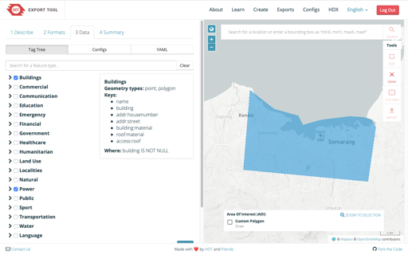

# Export Tool

The **Export Tool** creates OpenStreetMap exports for GIS programs and mobile devices. It outputs files in various tabular formats based on an input area of interest polygon and a selection of OpenStreetMap tags. It is synchronized minutely with the main OSM database, so exports can be created to accompany real-time humanitarian mapping efforts.

# Get involved!

This is the source code for the web service available at [export.hotosm.org](https://export.hotosm.org). If you would like to export OSM data offline without using the web site, you can access the separate command line tool and Python Library. This repository is at [github.com/osm-export-tool-python](https://github.com/hotosm/osm-export-tool-python). *NOTE: as of 8/2019, this project is not integrated into the web service yet.*

## How to report a problem or bug

* Please include a link to the export's download page. This will be a URL that looks like this: [export.hotosm.org/en/v3/exports/cb709d41-6f78-4ee5-8e9a-9eae7b63177c](https://export.hotosm.org/en/v3/exports/cb709d41-6f78-4ee5-8e9a-9eae7b63177c)
* Include the GIS program you are using and the version: for example, QGIS 3.8.
* Screenshots of the web interface or the data within your GIS program are always helpful!

## For Developers

The code in this repository powers the export tool web service and includes a number of features beside creating GIS files:

* Periodic exports for HOT's partner humanitarian organizations, such as those that appear on the [Humanitarian Data Exchange](https://data.humdata.org) platform.
* Authentication via OSM accounts and email notifications for when exports are complete.
* Storage of YAML feature tag selections.
* A rich user interface with error reporting and geometry drawing/uploading, built on OpenLayers.

If you would like to host the Export Tool yourself, see the `ops` folder, which includes instructions for setting up both an Overpass Instance and the Export tool web app on Ubuntu. 

If you would like to enhance the code of the Export Tool web app, a guide to installing it in a local development environment is at [docs/setup-development.md](doc/setup-development.md).
